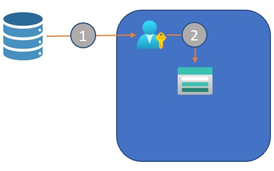
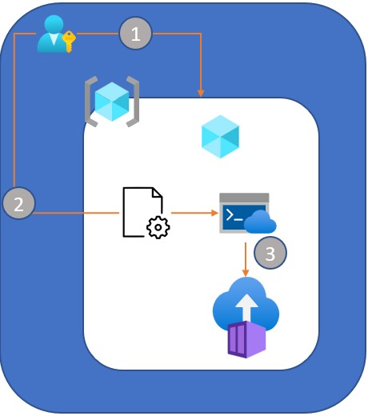
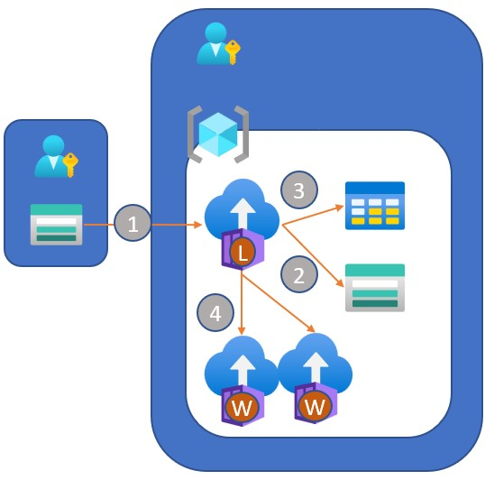
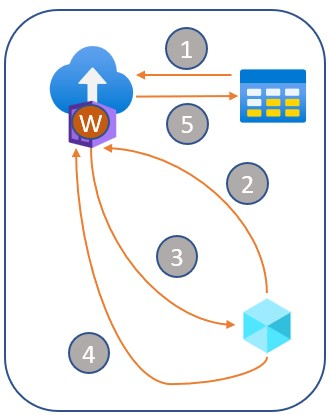

# OSDU Bulk Data Loading

A generic process of loading and tracking a large number of files into the OSDU instance. 

# Requirements

- Separate Azure Storage Account with a File Share hosting data to be pushed to the ODSU system. This storage account may or may not live in the same subscription as the OSDU deployment, there is no requirement since the user will provide information for the execution.
- An OSDU instance that has been pre-created in Azure. 

## Azure Requirements
- Azure subscription(s) in which to host an Azure Storage account. 
- Azure subscription in which an OSDU instance can be deployed. 

## Customer Requirement
The customer fills out the details in the __custinput.sh__ file. It contains information about the file share that they have created for a data set as well as information about the OSDU instance they have deployed into their subscription. 

# Execution
To execute this test locally, open up __custinput.sh__ and change the values for all DATA_SOURCE_* fields to a sub/rg/storage acct/file share with the files to upload. Note the path of the files in the share and update DATA_SOURCE_MAP to files you want to ingest. 

Modify the other settings to your OSDU deployment Sub/RG. 

Open up a bash shell to this directory and run the following:

> az login
> ./custrun.sh custinput.sh

<b>Sub Sections</b>
- [Work flow](#flow)
- [Storage Table Records](#storage-table-record)

## Flow

<table>
    <tr> <td colspan=2> Customer Data Acquisition</td></tr>
    <tr>
        <td width="40%">
            <ol type="1">
                <li>Customer acquires data set.</li>
                <li>Customer loads dataset into Azure Storage File Share into any subscription they choose.</li>
            </ol>
        </td>
        <td>
            
        </td>
    </tr>
    <tr> <td colspan=2> Customer Initiated Load</td></tr>
    <tr>
        <td width="40%">
            <ol type="1">
                <li>Customer deploys OSDU instane into any subscription they choose.</li>
                    <ul>
                        <li> User must have access to the subscripiton with the file share in it.
                    </ul>
                <li>Customer collects information about the dataset file share and OSDU deployment and modifies the settings file <b>custinput.sh</b> </li>
                <li>Customer logs into Azure Cloud Shell and executes the script. Script will launch the load container after required resource data has been collected.</li>
                    <ul>
                        <li> ./custrun.sh custinput.sh
                        <li> Very rough start here, currently runs locally. Need better solution for execution
                    </ul>
            </ol>
        </td>
        <td>
            
        </td>
    </tr>
    <tr> <td colspan=2> Load Container</td></tr>
    <tr>
        <td width="40%">
            <ol type="1">
                <li>Creates Azure Storage Account in Resource Group containing OSDU instance, then scans customer file share using filters set up in the input script.</li>
                <li>Generates a metadata record for the file and stores into the newly created file share from step 1. </li>
                <li>Creates a record with the SAS URL to the original file, and location of the metadata record in storage from step 1.</li>
                <li>Creates a workflow manifest file for each work container to launch. Then, for each manifest launches a workload container to manage the workflow.</li>
            </ol>
        </td>
        <td>
            
        </td>
    </tr>
    <tr> <td colspan=2> Workload Container</td></tr>
    <tr> <td colspan=2> Container uses joblib.Parallel to spread out it's work across batches of files. Diagram depicts the work on each individual file. </td></tr>
    <tr>
        <td width="40%">
            <ol type="1">
                <li>Retrieve the table record using the record ID stored in the workflow manifest.</li>
                <li>Obtain an upload URL from OSDU.</li>
                <li>Move the file to the upload URL using the SAS TOKEN URL for the orignal file followed by uploading the metadata record. </li>
                <li>Retrieve the file version from OSDU to validate it made it.</li>
                <li>Update the associated record in the storage table if succesful.</li>
            </ol>
        </td>
        <td>
            
        </td>
    </tr>
</table>

## Storage Table Record

The following describes the storage table records 

|Field|Description|
|-----|-----|
|PartitionKey|Partition in the table for this record.|
|RowKey|A GUID generated so we can record/find specific records.|
|Timestamp|The date/time the record was created.|
|processed|A boolean flag indicating if this record has been processed succesfully. When true, any further searches to upload will ignore this record to avoid duplicates.|
|processed_time|Date time the record was processed succesfully or not.|
|code|The status code ONLY if the processing of the record failed.|
|container_id|The ACI container ID (auto generated guid) to track which container processed the record.|
|file_name|The path in the source file share where the file resides.|
|file_size|Size of the file, in bytes, as it sits in the source file share. Needed because the OSDU SAS URL does not have enough rights to query properties, so this field is used to determine wait times when uploading to OSDU.|
|metadata|The path to the generated metadata in the destination storage account used for logging, etc.|
|source_sas|The SAS URI of the file in the source storage account, these SAS tokens are valid for 24 hours.|
|meta_id|When succesfully processed, this is the OSDU identifier of the metadata record.|
